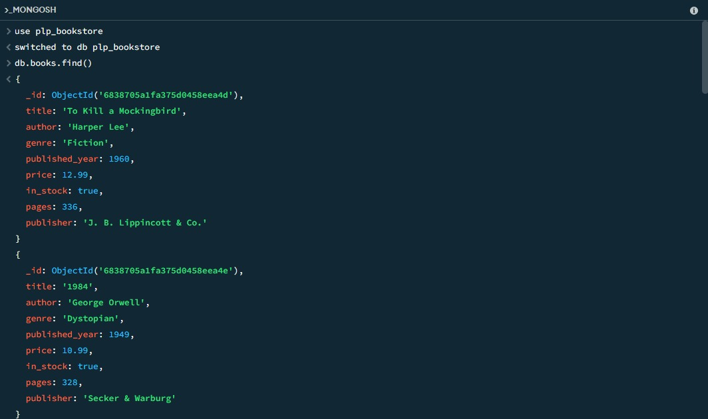
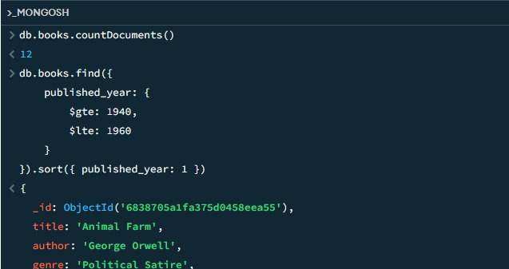
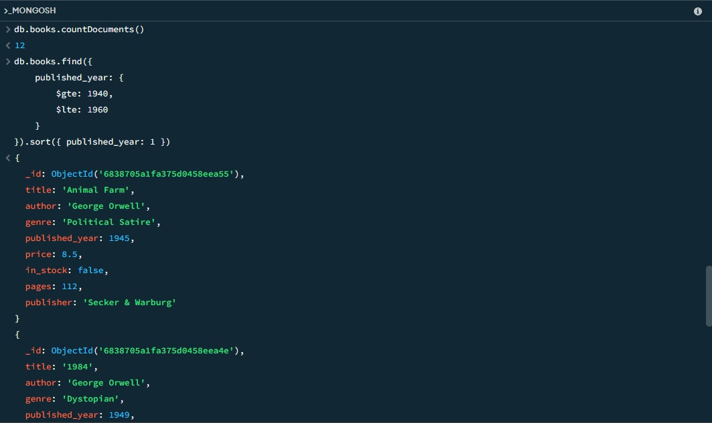
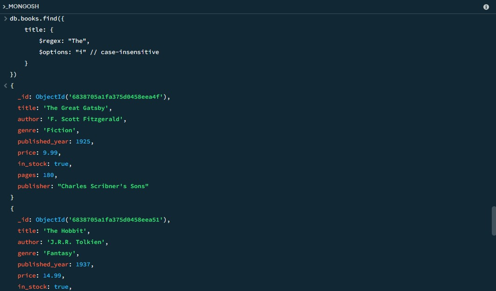
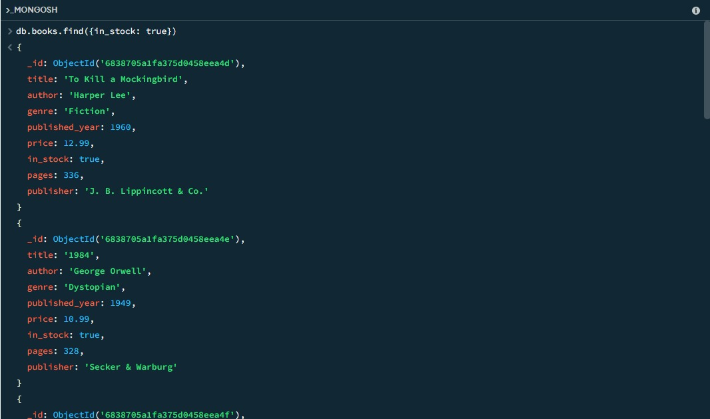
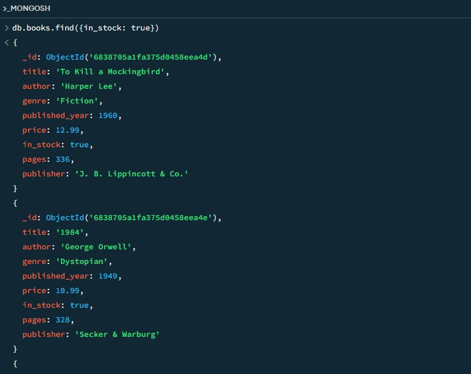

# MongoDB Bookstore Database Project

A comprehensive MongoDB database implementation for a bookstore management system, featuring sample data insertion and advanced query operations.

## 📋 Table of Contents

- [Project Overview](#project-overview)
- [Prerequisites](#prerequisites)
- [Setup Instructions](#setup-instructions)
- [Database Schema](#database-schema)
- [Sample Data](#sample-data)
- [Query Examples](#query-examples)
- [Advanced Operations](#advanced-operations)
- [Screenshots](#screenshots)
- [Usage](#usage)

## 🎯 Project Overview

This project demonstrates MongoDB database operations for a bookstore application. It includes:

- Database setup and sample data insertion
- Basic CRUD operations
- Advanced aggregation pipelines
- Text indexing and search capabilities
- Data analysis queries

## 📋 Prerequisites

Before running this project, ensure you have:

- Node.js (v14 or higher)
- MongoDB (Community Edition or Atlas)
- MongoDB Node.js Driver (`mongodb` package)

## 🚀 Setup Instructions

1. **Clone or download the project files**

2. **Install dependencies**
   ```bash
   npm install mongodb
   ```

3. **Start MongoDB service**
   ```bash
   # For local MongoDB installation
   mongod
   ```

4. **Run the data insertion script**
   ```bash
   node insert_books.js
   ```

5. **Connect to MongoDB shell**
   ```bash
   mongosh
   use plp_bookstore
   ```

## 📊 Database Schema

The bookstore database (`plp_bookstore`) contains a `books` collection with the following schema:

```javascript
{
  title: String,           // Book title
  author: String,          // Author name
  genre: String,           // Book genre
  published_year: Number,  // Publication year
  price: Number,           // Price in USD
  in_stock: Boolean,       // Availability status
  pages: Number,           // Number of pages
  publisher: String        // Publisher name
}
```

## 📚 Sample Data

The database is populated with 12 classic books including:

- To Kill a Mockingbird (Harper Lee)
- 1984 (George Orwell)
- The Great Gatsby (F. Scott Fitzgerald)
- Brave New World (Aldous Huxley)
- The Hobbit (J.R.R. Tolkien)
- And more...

## 🔍 Query Examples

### Basic Queries

#### Find All Books
```javascript
db.books.find()
```
Retrieves all books in the collection.

#### Find Books by Specific Author
```javascript
db.books.find({author: "J.K. Rowling"})
```
Searches for books by a particular author.

#### Find Books in Stock
```javascript
db.books.find({in_stock: true})
```
Returns only available books.

#### Count Books in Stock
```javascript
db.books.find({in_stock: true}).count()
```
Counts the number of available books.

### Intermediate Queries

#### Find Books by Publication Year Range
```javascript
db.books.find({
    published_year: {
        $gte: 1939, // greater than or equal to 1939
        $lte: 1970  // less than or equal to 1970
    }
}).sort({published_year: 1}) // sort by published year in ascending order
```

#### Find Books with "The" in Title
```javascript
db.books.find({
    title: {
        $regex: "The", // regular expression to match "The" in the title    
        $options: "i" // case-insensitive search
    }
})
```

### Update Operations

#### Update Book Price
```javascript
db.books.updateOne(
    { title: "The Great Gatsby" }, // filter to find the book
    { $set: { price: 17.99 } } // update the price
)
```

## 🚀 Advanced Operations

### Aggregation Pipeline: Average Price by Genre
```javascript
db.books.aggregate([
    {
        $group: {
            _id: "$genre",
            averagePrice: {$avg: "$price"}, // calculate average price
            bookCount: {$sum: 1}, // count the number of books in each genre
            totalPages: {$sum: "$pages"} // sum of pages in each genre
        }
    },
    {$sort: {averagePrice: 1}} // sort by average price in ascending order
])
```

### Find Authors with Multiple Books
```javascript
db.books.aggregate([
    {
        $group: {
            _id: "$author",
            bookCount: {$sum: 1},
            books: {$push: "$title"},
            avgPrice: {$avg: "$price"}
        }
    },
    {$match: {bookCount: {$gt: 1}}},
    {$sort: {avgPrice: -1}} // sort by average price in descending order
])
```

### Text Search Setup and Usage

#### Create Text Index
```javascript
db.books.createIndex({
    title: "text",
    author: "text",
    description: "text"
})
```

#### Perform Full-Text Search
```javascript
db.books.find({
    $text: {$search: "brave dystopian"}
}, {
    score: {$meta: "textScore"} // include text score in results
}).sort({score: {$meta: "textScore"}}) // sort by text score in descending order
```

## 📸 Screenshots








## 💡 Usage

This project serves as a learning resource for:

- MongoDB database design
- CRUD operations in MongoDB
- Aggregation pipeline usage
- Text indexing and search
- Data analysis with MongoDB

## 🛠️ Key Features

- **Comprehensive Data Model**: Well-structured book information
- **Advanced Queries**: Complex filtering and sorting operations
- **Aggregation Pipelines**: Data analysis and grouping
- **Text Search**: Full-text search capabilities
- **Data Validation**: Proper data types and structure

## 📈 Query Performance Tips

1. Create indexes on frequently queried fields
2. Use projection to limit returned fields
3. Utilize aggregation pipelines for complex operations
4. Consider compound indexes for multi-field queries

---

*This project demonstrates practical MongoDB usage in a real-world bookstore scenario, showcasing both basic and advanced database operations.*